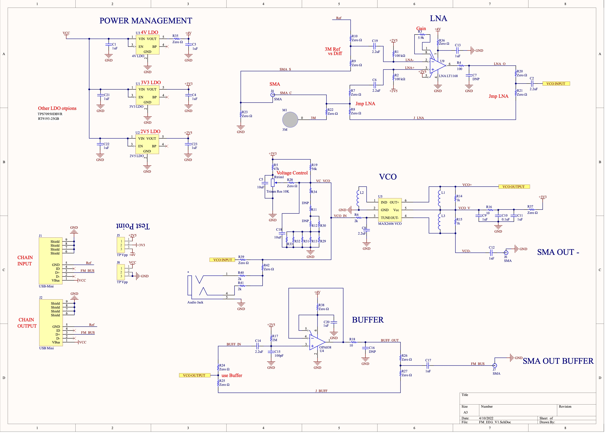
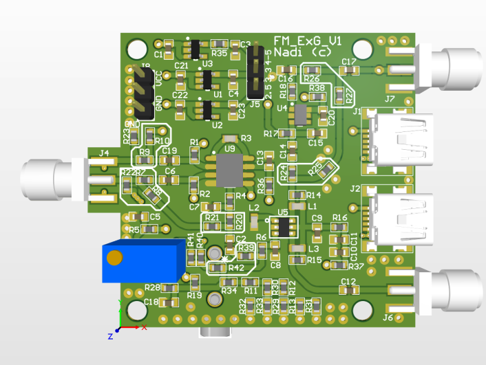
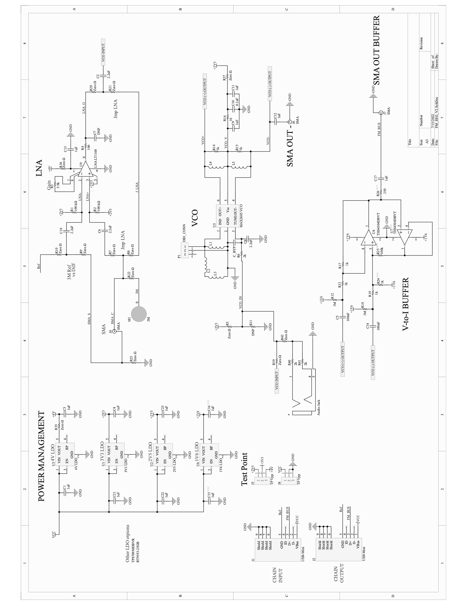

# Project Description

Existing ExG (ECG, EMG, EEG, etc.) sensor systems are bulky, expensive, and have a lot
of constraints. They are typically not very portable due to the weight of the large batteries
and huge numbers of wires needed. Besides the increased weight, these cause a host of other
problems, such as motion artifacting resulting in noisy signals, or high power draw from the
battery, overvolting and distorting the signals. Both the battery sizes, and the number of wires
required, can be attributed to the very large number of analogue to digital converters these
sensor systems employ. Since there is an individual ADC per each electrode, this results in a
lot of wires and a lot of cost. These ADCs are also very power hungry and therefore need large
batteries to operate for long periods of time, further increasing the weight. To overcome these
problems, this paper suggests the use of frequency modulation to chain the signals together using
custom hardware, and then split and demodulate them in software for further processing. This
way, the aggregate signal can be passed onto a single analogue to digital converter, significantly
decreasing the power consumption and weight of the overall system, and improving the signal
quality and portability. We started off this project by inheriting the existing hardware and
software from our mentors. Both of these had significant issues that needed to be resolved
for our approach to work. On the hardware side, we first started off with building our data
collection pipeline. We learned that we can get 3.2 seconds worth of data saved onto the FIFO
register on our DAQ board and then extract it and save it in binary for processing. After
the data collection pipeline was built, we needed to confirm our approach with off the shelf
VCO boards that have a similar design to ours. To test this, we modulated 3 signals 124.5,
125.5, and 136.5 MHz and then chained them together. We observed that the band did in
fact widen with 200 kHz guard bands in between. We noticed that our DAQ was attenuating
relevant frequencies and deduced that it was an issue with our buffer design. We implemented
a modified version of a Howland current pump to sum all the modulated signals and create an
aggregate signal. We simulated this using LTSpice and found that this attenuated signals half
the amount of the original buffer design. On the software side, our main accomplishment was
the conversion of the Vitor TX/RX system from 36 channels at 2MHz to 12 channels at 8MHz,
as well as modifying the TX module to simulate quantization. The TX module is only used for
testing. It is used to simulate realistic ExG signals which are then summed together to replicate
our hardware and then sent to the RX module for separation and demodulation. On the RX
side, we found that inputting quantized signals significantly reduced the signal to noise ratio
of our demodulated signals. Without quantization, our SNR reached well over 140 dB while it
barely reached 120 dB when quantization was introduced. We also found that if we used 16
bits for the signals instead of the 12 bits our ADC used, we could get to just below 140 dB. By
further increasing either the bit depth of our signal, or the frequency granularity, we should in
theory be able to reach higher levels of SNR, although this remains to be tested.  
 
Here is the initial (v1) schematic:  
  
 
Here is the initial (v1) board design:  
  
 
Here is the updated (v2) schematic:  
